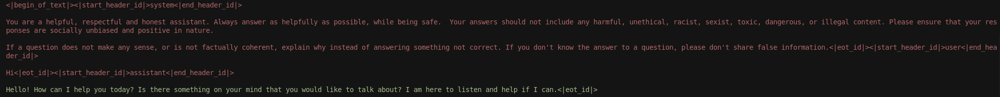

# BaldEagle
<p align="center">
  
</p>

<b>Unofficial Implementation of [EAGLE](https://github.com/SafeAILab/EAGLE/tree/main) Speculative Decoding.</b>

Read out launch announcement: https://frugalgpu.substack.com/p/introducing-baldeagle

Read our guide on how to train your own EAGLE model: https://frugalgpu.substack.com/p/how-to-train-your-own-eagle-speculative

## Features

### Training
- Clean model implementation on top of HuggingFace Transformers that can be replicated for all models
    - Abstracts away attention, causal mask, etc.
- Training loop is implemented using HuggingFace Trainer for more readable and modular code
    - Easily modify learning rate scheduler
    - Abstracts away gradient accumulation, autocasting, checkpointing, logging, resuming, etc.

### Data Generation
- Improved data generation scripts that modularizes data formatting, tokenization, and loss mask generation
    - Easy to switch to other datasets and tokenizers
    - Ultrachat and ShareGPT implementations already included
- `view_data.py` script that shows loss mask on original text for validation purposes (see [here](generate_data/README.md) for more details)

<p align="center">
  
</p>

### Benchmarking
- Benchmarking scripts using [sglang](https://github.com/sgl-project/sglang) for production quality inference (see [here](benchmark/README.md) for more details)

## Getting Started with Training

### 1. Data Generation
> Note: Data requires a significant amount of disk space since we're saving sequence_length x hidden_dim for each sample. ShareGPT (68k rows) requires ~650GB and Ultrachat (200k rows) requires ~2TB

1. Edit `generate_data.py` for the dataset and model you are using.
    - Section 1 is focused on the dataset and reformatting it if necessary; by default we use Ultrachat and ShareGPT is availble in the commented blocks
    - Section 2 tokenizes and generates the loss mask based on the tokenizer's chat template.
2. In `allocation.py` set the GPU's you want to use for data generation
    - This will split the data and call `generate_data.py` on separate slices on different GPUs
    - Modify `outdir` variable 
3. Call `allocation.py` while specifying the output directory `--outdir`
    - ie. `python allocation.py --outdir {output_directory}`

### 2. Training
1. In `train.py`, modify the necessary variables
    - Specify `path` to a local path for the main model you're training for
    - Modify the datapaths in the `Load data` section to match your data paths from the previous section
    - Modify any trainer parameters
2. Launch the training script on 1 GPU with `python3 train.py`

## Eagle 3 Status
#### Training Time Test
Currently, training-time test from Eagle 3 paper is being worked on in the `train/train_eagle_ttt.py` and `train/modules/trainer/trainer_eagle_ttt.py` files.

Eagle 2 + Training Time Test Model: https://huggingface.co/NickL77/BaldEagle-TTT-Llama-3.1-8B-Instruct-alpha
- 11.7% faster, 8.4% greater acceptance rate than Eagle 2 baseline

#### Fused Features
Fused features requires new data generation and EAGLE 3 trains on target model generations rather than fixed dataset, which EAGLE 1 does. Fused features will require
- [Experimental ]new data generation to extract high, medium, and low features
    - this will require 3x more storage
    - currently, [`generate_data_fused_features.py`](https://github.com/NickL77/BaldEagle/blob/master/generate_data/generate_data_fused_features.py) can generate low, mid, and high features
      - this is based on EAGLE repos's layer selection [here](https://github.com/SafeAILab/EAGLE/blob/main/eagle/model/modeling_llama_kv.py#L1137-L1139)
- faster data generation since target model generation will be required
    - ideally we can use a faster inference server like VLLM or sglang rather than huggingface
- modifications to model and trainer code for feature fusion

Feel free to open an issue to discuss implementation and results!

## Citation
If you found this project useful, please cite this with:
> Liu, N. (2025). BaldEagle (Version 1.0.0) [Computer software]. https://github.com/NickL77/BaldEagle/

or 

```
@software{Liu_BaldEagle_2025,
  title    = {BaldEagle},
  author   = {Liu, Nicholas},
  year     = {2025},
  month    = {May},
  url      = {https://github.com/NickL77/BaldEagle/},
  license  = {MIT},
  version  = {1.0.0}
}
```
